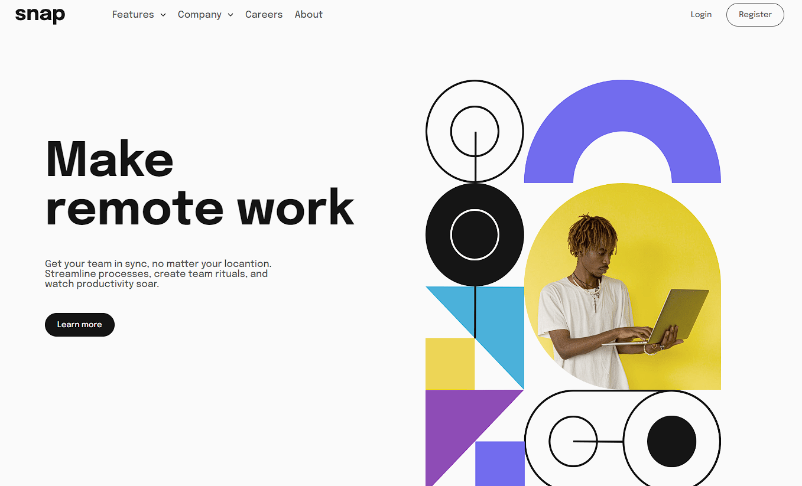

# Snap (Landing page)
 

> FrontEnd Mentor Challenge

Uma Landing page que possui responsividade para dispositivos diferentes e animações feita por mim utilizando o Layout do site "FrontEnd Mentor" para treinar minhas habilidades como dev.

## [🔗 Clique aqui para acessar o projeto](https://loren175.github.io/snap)

#

## 📕 Layout
- Você pode visualizar o projeto e o desafio através [desse link.](https://www.frontendmentor.io/challenges/intro-section-with-dropdown-navigation-ryaPetHE5)

## 🚀 Tecnologias

- HTML
- CSS
- JavaScript
- Git e Github

## 📞 Contato

>rafael.loren175@gmail.com

>+55 (11) 99959-9140

## 👾 Discord

>rafas#7622